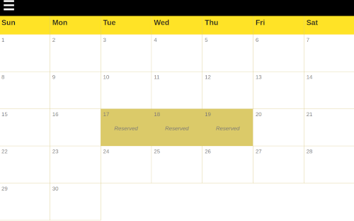
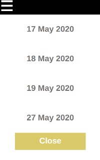
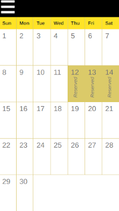

# Reservation Calendar

## Intro

A calendar that can be used for making reservations.

## Run

- Clone https://github.com/salis010/reservation-calendar
- Install packages `npm i`
- Run server: npm run start
- In the browser go to http://localhost:3000/

## Tech

- React
- Redux
- Styled Components
- Jest

## How it Works

The app has only one month, for demo purposes.

A user can click a day to make a reservation, and click it again to cancel the reservation.

Reservations can be seen by opening the menu and clicking on 'Reservations'.

The app is responsive for mobile screens.

